# Screenshot Gallery

These captures use the populated, non-destructive demo project in bilingual
English and Hong Kong Cantonese mode.
Paths are intentionally neutral, every route uses the same viewport and
scale, and no real Windows image, product key, credential, or private project is
shown.

呢套截圖用已填好、唔會實際改映像嘅 demo 工程，預設同時顯示 English 同自然香港粵語。所有路徑都係中性測試資料，唔會放真實 Windows 映像、product key、密碼或私人工程入鏡。

## Project Start / 工程起始頁
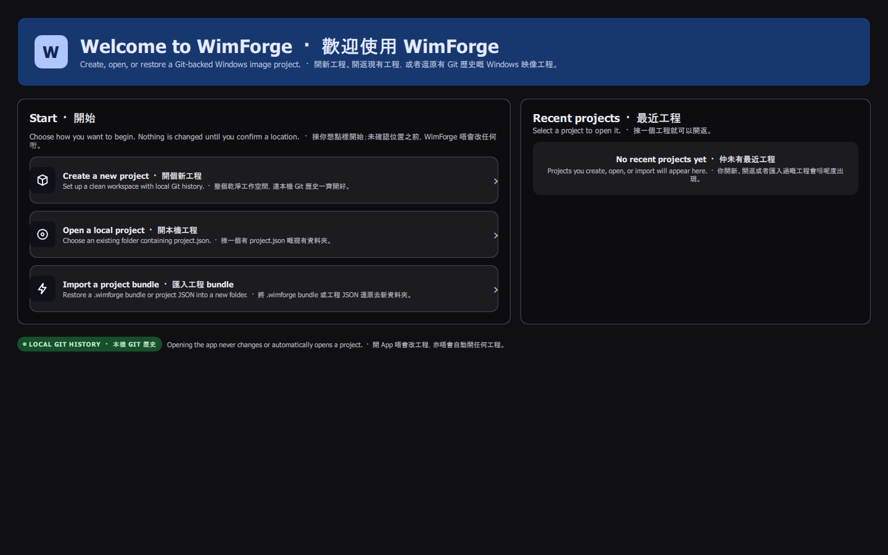

開啟 WimForge 會先到呢個類似 Visual Studio 嘅工程管理頁；你可以建立新工程、開啟現有資料夾、匯入 `.json` / `.wimforge`，或由最近工程清單繼續。

## Overview
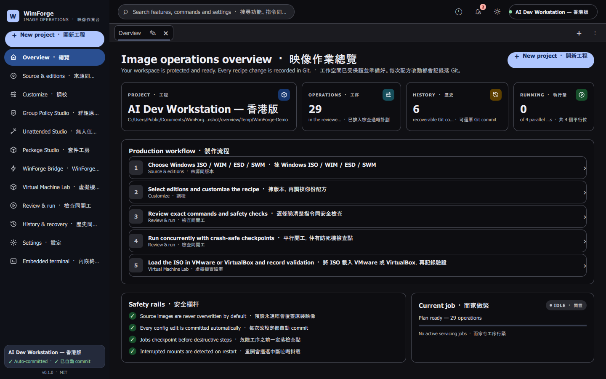

## Source and editions
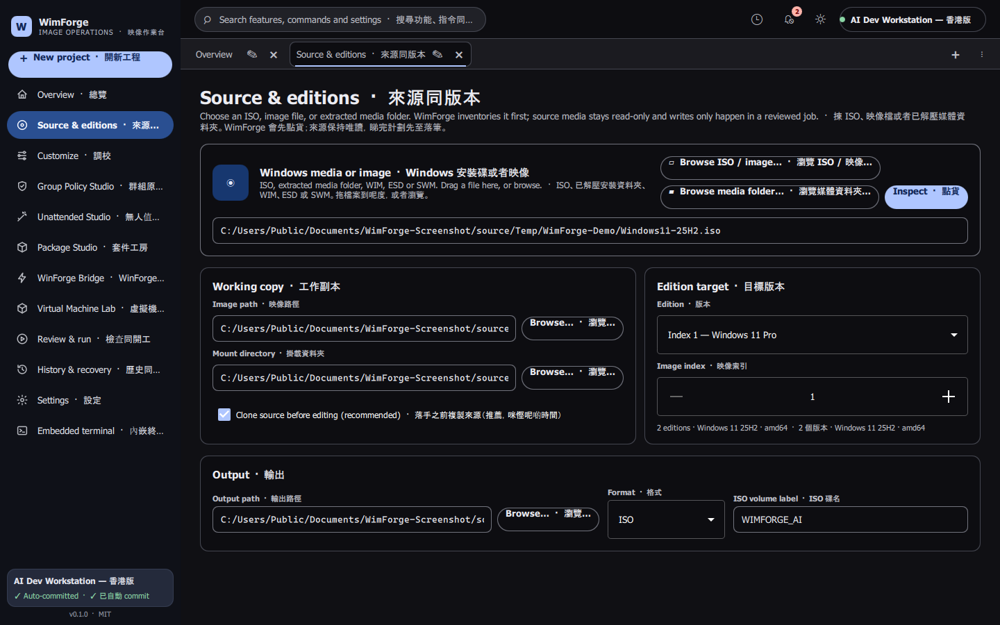

## Customize
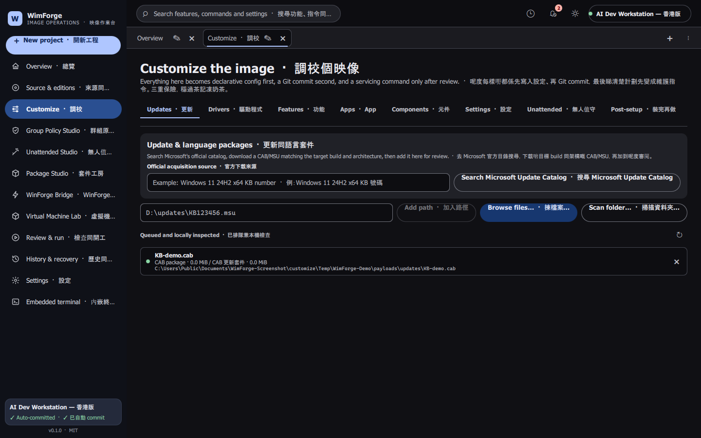

## Group Policy Studio
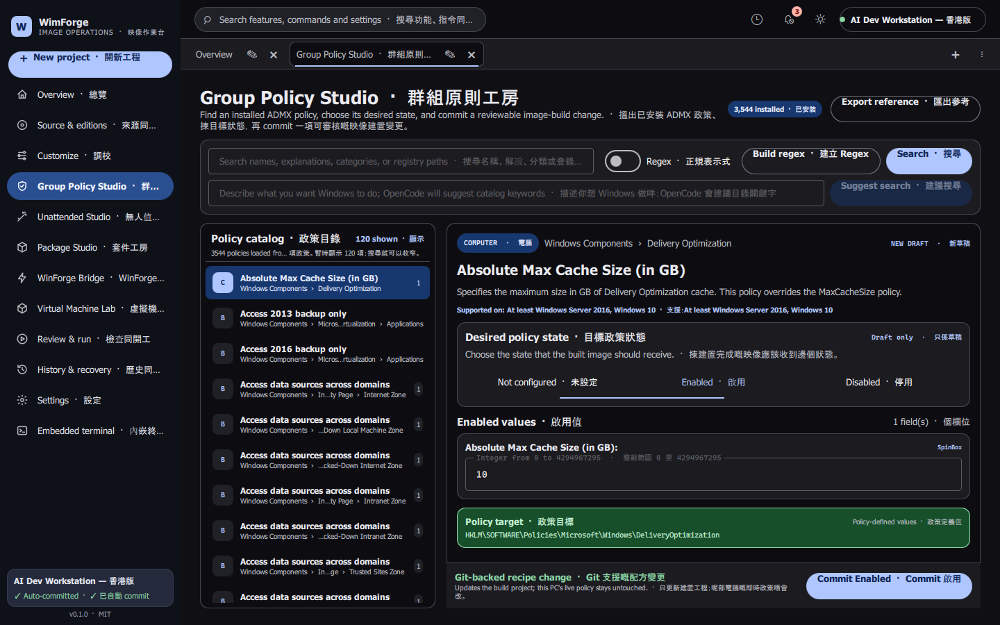

## Unattended Studio
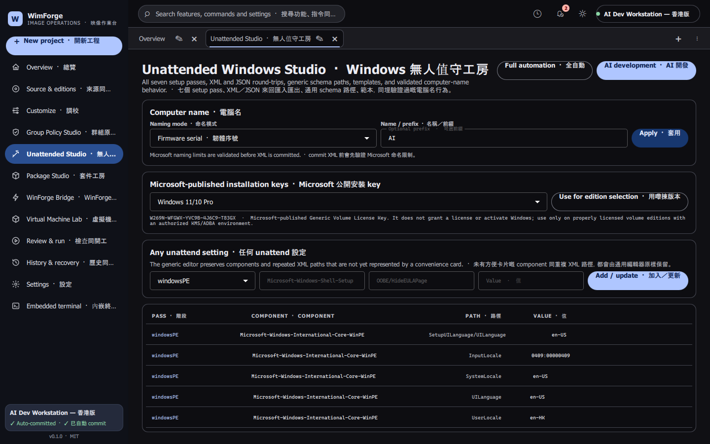

## Package Studio
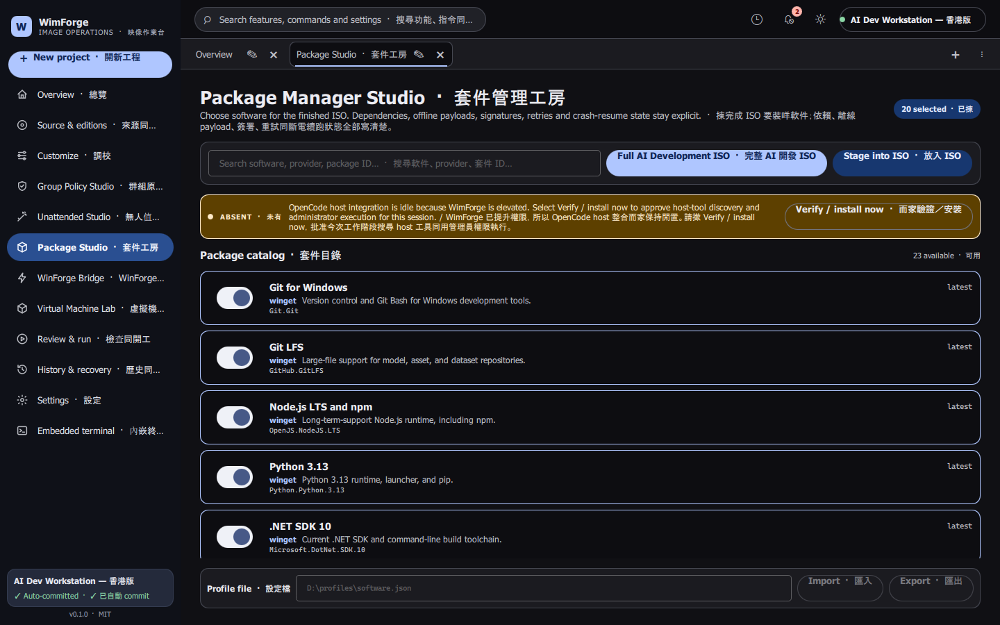

## WinForge Bridge
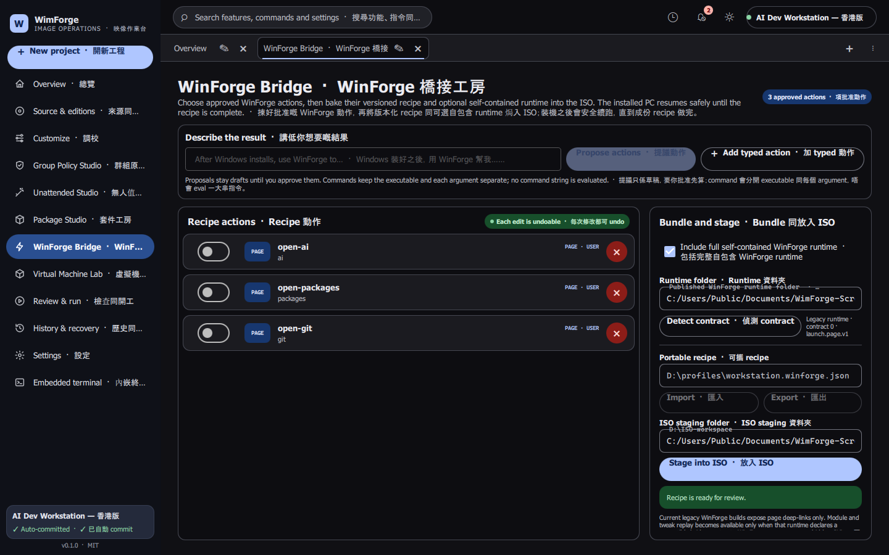

## Virtual Machine Lab
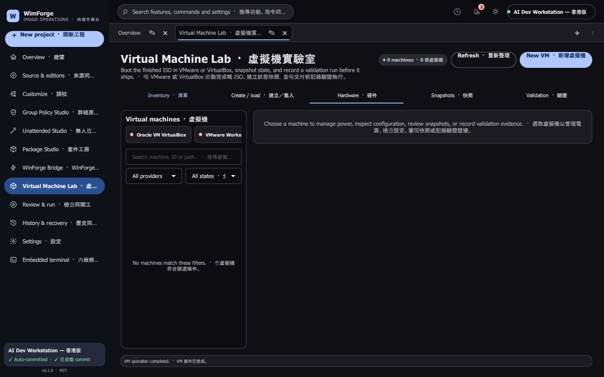

## Review and run
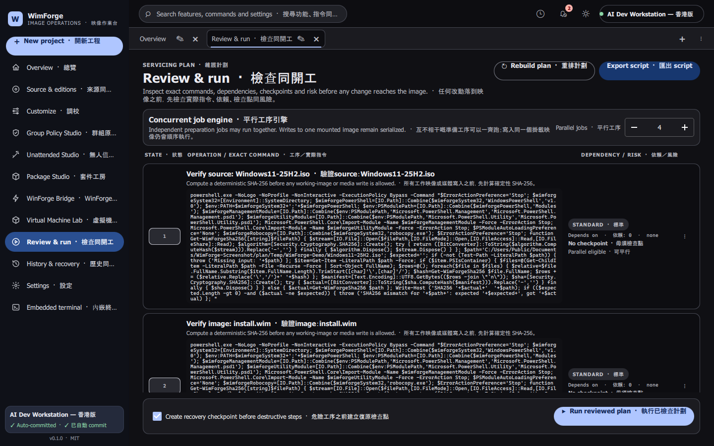

## History and recovery
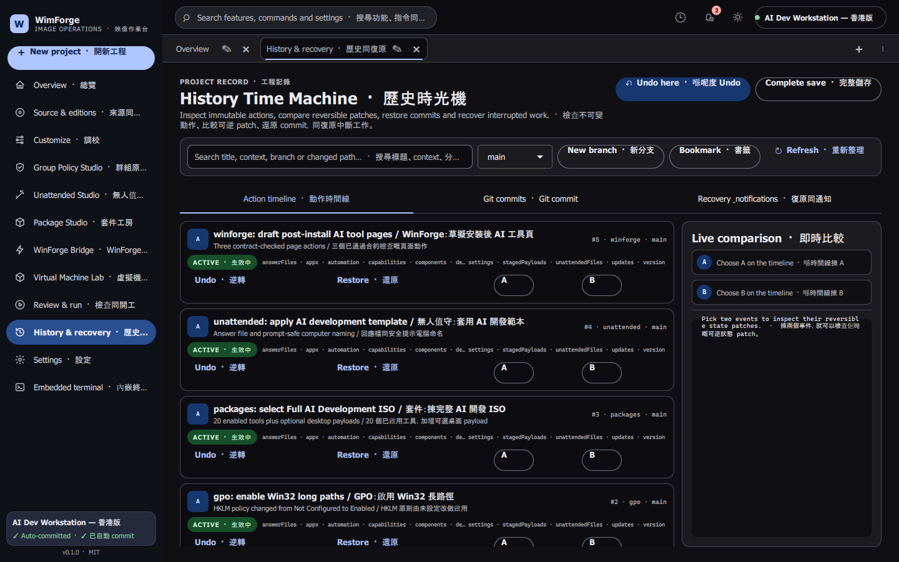

## Settings
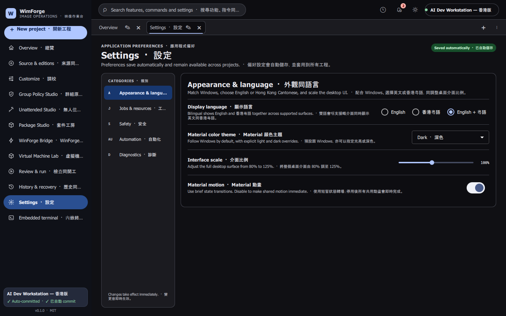

## Embedded terminal
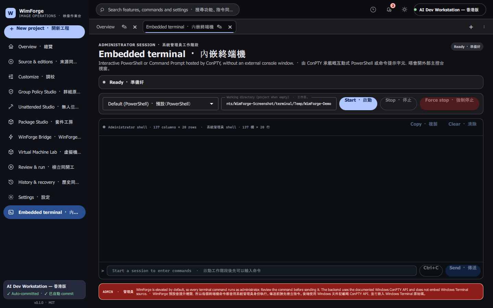

!!! info "Reproduce the gallery"
    Configure `build-capture` with
    `-DWIMFORGE_DOCUMENTATION_CAPTURE=ON`, build its Debug `WimForge` target,
    then run `scripts/capture-documentation-screenshots.ps1`. This restricted
    as-invoker harness accepts only demo screenshot runs; normal and release
    builds remain elevated. The script launches each route and saves a frame
    directly from its Qt Quick window.

    標準畫廊以 `--language bilingual` 拍攝；全套截圖要用同一個 commit、theme、viewport 同 DPI，而且路徑一定要保持中性。
